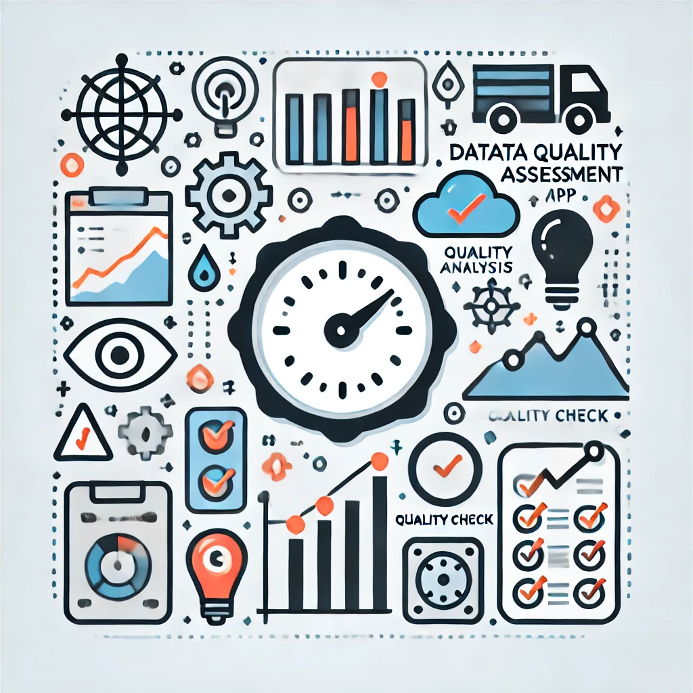

# IIoT Data Quality Assessment App


A service designed to analyze and assess the quality of high frequency data collected from Industrial Internet of Things (IIoT) sensors, efficiently.## Dependencies 
This app reads multiple sensor readings that monitor a machine from [LeanXcale database](https://www.leanxcale.com/real-time-analytics) supporting energy efficient and incremental analytics.

## Features 
- **Data Loading**: Import raw data or connect to the LeanXcale (LXS) database via Kafka for real-time data streaming. 
- **LeanXscale Integration**: Leverage online aggregates and incremental analytics for fast and efficient data processing. 
- **Data Annotation**: The aggregated data are automatically annotated based on the nominal sensor values and can be exported to for further exploitation. 
- **Data Visualization**: Visualize the loaded and aggregated data to understand its structure and quality. 
- **Missing Values Analysis**: Detect and handle missing values in the raw sensor dataset, utilizing aggregated data. 
- **Invalid Values Analysis**: Identify and analyze invalid readings or alarms from your sensors. 
- **Data Quality**: Perform comprehensive data quality assessments, including metrics and visualizations.

## Setup
### Prerequisites
- Python 3.8 
- Docker
- Energy Efficient Incremental Analytics (LeanXscale docker service)
  - https://docs.leanxcale.com/leanxcale/v2.3/sql_reference/sql-ddl.html#_create_online_aggregate_and_drop_online_aggregate_statements
  - https://blog.leanxcale.com/hands-on/online-aggregations-in-leanxcale/
- IoT Fast Data Importer for KPI Monitoring (LeanXscale Data Importer)
- Description of Sensors


### Data Description Requirements

Provide a `csv` file describing the sensors. The file should adhere to the following format and contains the specified columns. Below is a detailed description of each required column and its expected content:

### TAG:
- **Description**: A unique identifier for each sensor.
- **Example**: `22PI102`

### Tag Description:
- **Description**: A brief description of the tag or sensor, explaining what it measures or monitors.
- **Example**: `SEAL OIL MAIN PUMP PRESSURE`

### MACHINE_GROUP:
- **Description**: The group or category of machinery to which the tag belongs.
- **Example**: `K-2201`

### LOW_THRESHOLD:
- **Description**: The lower limit or threshold for the acceptable range of the tag's measurements.
- **Example**: `6`

### HIGH_THRESHOLD:
- **Description**: The upper limit or threshold for the acceptable range of the tag's measurements. If not applicable, it can be left empty.
- **Example**: `NaN`

### THRESHOLD_TYPE:
- **Description**: Indicates the type of threshold (e.g., "Down" for lower limit thresholds). One of (`Up, Down or Up/Down`)
- **Example**: `Down`

### AGGREGATION_RULE:
- **Description**: The rule for aggregating data points (e.g., `min` for minimum value).
- **Example**: `min`

### ENGINEERING_UNITS:
- **Description**: The units in which the measurements are recorded.
- **Example**: `Kgf/cm2`

### CATEGORY:
- **Description**: The category of the measurement, such as `Pressure`, `Temperature`, etc.
- **Example**: `Pressure`

### Sample Data Format

| TAG     | Tag Description                         | MACHINE_GROUP | LOW_THRESHOLD | HIGH_THRESHOLD | THRESHOLD_TYPE | AGGREGATION_RULE | ENGINEERING_UNITS | CATEGORY |
|---------|-----------------------------------------|---------------|---------------|----------------|----------------|------------------|-------------------|----------|
| 22PI102 | SEAL OIL MAIN PUMP PRESSURE             | K-2201 | 6             | NaN            | Down           | min              | Kgf/cm2           | Pressure |
| 22PI103 | CONTROL OIL HEADER PRESSURE             | K-2201 | 5             | NaN            | Down

### Step 1: Clone the Project
```bash
git clone https://github.com/giorgosfatouros/IIoT-Data-Quality-Assessment.git
cd iiot-data-quality-assessment-app
```

### Step 2: Start LeanXcale docker service (if needed)
```bash
docker run --name leanxcaledb-service --env KVPEXTERNALIP='leanxcaledb-service!9800' -p 0.0.0.0:1529:1529 -d ferrari 
```
For Installing LeanXscale refer here: https://gitlab.gftinnovation.eu/fame/leanxcaledb.git

### Local Installation

1. Navigate to the project directory:

```bash
cd iiot-data-quality-assessment-app

```
2. Create and activate a virtual environment:
```bash
python -m venv iot
source iot/bin/activate
```

3. Install the LeanXcale Python client and project dependencies:
```bash
pip install pyLeanxcale-1.9.13_latest-py3-none-any.whl 
```
4. Install any additional requirements:
```bash
pip install requirements.txt
```
#### Step 4: Running the App
To run the app, navigate to the project directory in your terminal and execute:
```bash
streamlit run app.py
```
### Docker Installation 

```bash
docker-compose up -d
```

### 4. Usage 
Go to: http://www.localhost:8501
Follow the instructions within the app to upload your sensor data.
 1. **Data Loading**: Navigate to the **Data Loading** page to select the data table (machine) for analysis.
 2. **Data Visualization**: Use the **Data Visualization** page to explore the data through various visualizations.
 3. **Missing Values Analysis**: Go to the **Missing Values Analysis** to get insights for missing values into the original/raw data.
 4. **Invalid Values Analysis**: The **Invalid Values Analysis** page helps you identify and understand invalid readings from your sensor data.
 5. **Data Quality**: Access the **Data Quality** page for a detailed assessment of your data's quality, including completeness, accuracy, and consistency.

### Acknowledgements
The project has received funding from the European Union’s funded Project HEU FAME under Grant Agreement No. 101092639.

