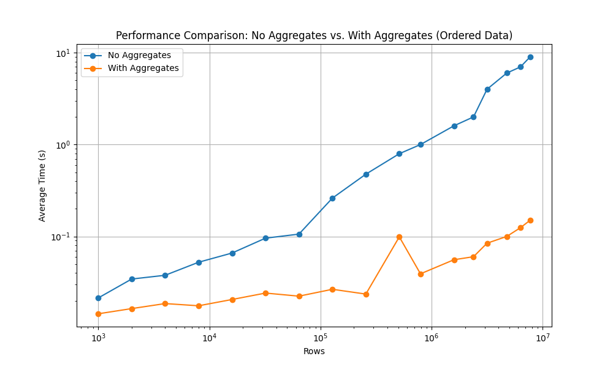
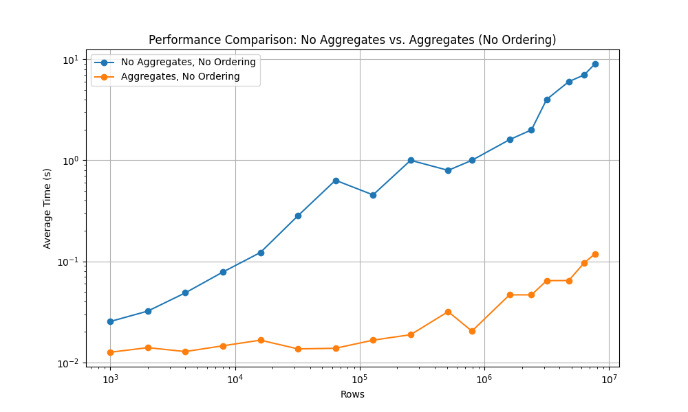

# Performance Evaluation Results

This document provides an analysis of the performance evaluation results for a dataset having readings from 8 sensors monitoring a single machine with 10 seconds frequency. The evaluation compares the query latency with and without data aggregation and ordering. The evaluation was conducted using various row counts to understand the impact on processing time.

## Performance Comparison: Aggregates vs. No Aggregates (With Ordering)

### Description
The performance of the dataset was evaluated with and without the use of data aggregation. The results demonstrate the efficiency improvements brought by FAME's Energy Efficient Incremental Analytics. The tests were conducted with data ordering enabled.

### Results
The results are plotted in the figure below:

### Observations
- The use of aggregates significantly improves performance, especially for larger datasets.
- Performance is more stable and efficient with aggregates compared to no aggregates.

## Performance Comparison: Aggregates vs. No Aggregates (No Ordering)

### Description
The performance of the dataset was also evaluated without data ordering to assess the impact of ordering on processing time. Similar to the previous test, the results show the benefits of using data aggregation.

### Results
The results are plotted in the figure below:

### Observations
- Without ordering, aggregates still provide a performance boost, though the overall processing times are slightly higher compared to the ordered dataset.
- The stability and efficiency of using aggregates are evident in both ordered and unordered datasets.

## Conclusion
The evaluation clearly shows that using data aggregation significantly enhances performance and stability in processing large datasets. The use of data ordering further optimizes processing times. These findings suggest that implementing data aggregation strategies is crucial for maintaining efficient and scalable data processing workflows in industrial applications.

## Future Work
Future evaluations will explore the impact of different features offered by the  IIoT Data Quality Assessment App.
